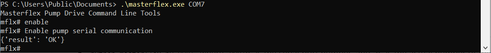

# Masterflex Serial Communication

MasterflexSerial, the Python module, is used to communicate with Masterflex Pumps through RS232 serial communication over USB[1].

# Hardware Requirement

- RS232 Serial communication is available via virtual com port utilizing the USB port on the back panel of the pump drive.  The Masterflex [MFLX78006-90](https://www.avantorsciences.com/us/en/product/43207516/masterflex-usb-a-serial-adapter-cables-avantor) USB-A to USB-A cable is needed[2].
- Please refer to Masterflex Serial Communication manual for more details.

**Optional:**  
- The Masterflex [MFLX78006-91](https://www.avantorsciences.com/us/en/product/NA5266790/masterflex-usb-a-serial-adapter-cables-avantor) USB-A to PLC cable (1.8m) can also be used for RS232 communication, offering compatibility with PLC applications.

## Accessing the COM Port
- Connect the Masterflex [MFLX78006-90](https://www.avantorsciences.com/us/en/product/NA5266790/masterflex-usb-a-serial-adapter-cables-avantor) cable to the PC.
- For Windows:
  - In the PC's "Start Menu", open "Device Manager", navigate to and extend "Ports (COM & LPT)" and note the COM number for "USB Serial Port".
  
    

    The `COM` port is normally `COMx` where `x` is the port number.
- For Linux or MacOS:
  - The `PORT` is normally `/dev/ttyUSBx` where `x` is port number.
  

## Quick Start for Window Users

To control a Masterflex pump using serial communication, perform the following steps: 

- Download the excutable masterflex.exe from the repository <url>https://github.com/masterflexbp/masterflex-serial/releases/tag/V1.0</url>
- Click Start Menu of the PC, start either `PowerShell` or `Command Prompt`
- Change path to the location of the `masterflex.exe` file using the following command: `cd <directory_path>`
- Run the Serial Comm executable by entering the following command: `.\masterflex.exe COMx`; where `COMx` is the aquired through the previous step. In the below example, the `COMx` is `COM7`

    

- On the Console app, type `?, h` or `help` for help. The current supported commands are
   
  ```Masterflex Pump Drive Command Line Tools
        mflx# ?
        Supported commands:
        enable                : Enable Pump's Serial Comms module
        disable               : Disable Pump's Serial Comms module
        status                : Get the status of the pump
        dispense-status       : Get dispense status
        start                 : Start pump
        stop                  : Stop pump
        dir-cw                : Set pump's direction to Clockwise
        dir-ccw               : Set pump's direction to Counter-clockwise
        speedp                : Get the pump's speed in percentage
        speedp XX.X           : Set the pump's speed in percentage
        speedr                : Get the pump's speed in RPM
        speedr XX.XX          : Set pump's speed in RPM
        volume                : Get pump volume in current unit set
        volume-rev            : Get pump volume in rev
        unit-index            : Get the pump's flow unit index
        unit-index XX         : Set the pump's flow unit index
        id [id]               : Set the pump id
        reset-cumulative      : Reset cumulative volume in current unit set
        panel-active          : Sets control panel to manual operation
        panel-inactive        : Sets control panel to inactive.
        mode-continuous       : Set dispense mode to continuous
        mode-time             : Set dispense mode to time
        on-time               : Get the pump on-time in full
        on-time HH:MM:SS.s    : Set the pump on-time in full
        on-time-ds            : Get the pump on-time in 1/10 seconds
        on-time-ds XXXX       : Set the pump on-time in 1/10 seconds
        on-time-m XXX         : Set pump on time in minutes
        on-time-hr XX         : Set pump on time in hours
        off-time              : Get off-time in full
        off-time HH:MM:SS.s   : Set off-time in full
        software-version      : Get the software version of the pump
        model-serial-version  : Get the pump model and serial version of the pump
        store-configs         : Set pump configurations to current values
        restore-configs       : Set pump configurations to default values
        batch-count           : Get the pump's Batch Count.
        batch-total XXXXX     : Set the pump's Batch Total.
        reset-batch           : Reset batch count to zero
        q, quit,exit          : to quit the program
        ?, h , help           : for help"


## For Development
### Setup Python Environment
- Clone Masterflex Serial repository from GitHub 
  + `git@github.com:masterflexbp/masterflex-serial.git`
  and `cd masterflex-serial`
- Setup virtual environment. **Python3** shall be installed on your system first, the library is tested with Python version from 3.8 to 3.12.
  + `python -m venv venv`
- Activate virtual environment
  + On Linux/MacOS `source venv/bin/activate`
  + On Windows: 
    + **Command Prompt** `> venv\Scripts\activate`
    + **PowerShell** `.\venv\Scripts\activate.ps1`
- Install necessary packages
  + `pip install -r requirements.txt`
  + Or `python setup.py install`

### Console application
- `masterflex.py` is a sample console application that serves as a starting point.  
- In virtual environment, run `python masterflex.py COMx` where `COMx` is the serial port number, aquired in above step. The app will behave like the above executable `masterflex.exe`. 


### Without tox
- Install test dependencies `pip install -r test-requirements.txt`
- Install the package `python setup.py install`
- Run the linter `flake8 masterflexserial tests --max-line-length 120`
- Run the pytest `pytest tests`
  
### With tox (pytest, flake8, etc)
Setup development environment
```
python -m pip install --user tox
```

Build, test and lint entire application.
```
tox
```
On Windows, add `python -m` in front of all the following commands related to tox (e.g., `python -m tox`).
<br/> 
<br/>
**Note:** If a Windows machine is used and a path-related error occurs, the `tox.ini` file needs to be modified to remove the `{toxinidir}/` from the links to requirements files.

Run flake8 only
```
tox -e flake8
```
Run pytest only
```
tox -e pytest
```
Run `tox --recreate` to recreate environments
- For Windows user, run the command in git bash
  

### Convert *.py to *.exe file
- Open a terminal or command prompt and navigate to the directory containing the masterflex.py, activate virtual environment
  use the following command to create the executable
  + `pyinstaller --onefile masterflex.py`
  
  **Note:** *remember to run both `pip install -r requirements.txt` and `pip install -r test-requirements.txt` before running the above command.*
- After PyInstaller finishes building the executable, it will create a `dist` directory within the project directory, the generated `masterflexserial.exe` file should be in there.

### Reference
- `[1]`: For IPC pumps, serial communication is available on both interfaces USB and DB9 serial port.
- `[2]`: For IPC pumps, the alternative [MFLX22050-58](https://www.avantorsciences.com/us/en/product/39208180/masterflex-usb-to-db9-m-rs-232-serial-adapter-cable-avantor) USB to RS232 with a DB9 port cable can also be used.
